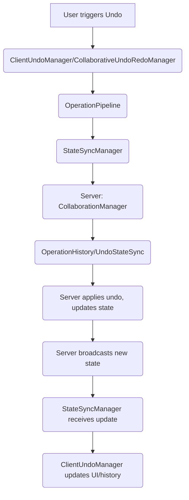

# Collaborative Undo System Audit Report

## Executive Summary

The collaborative undo/redo system in ImageCanvas is designed to provide server-authoritative, multi-user aware undo/redo functionality. However, in practice, collaborative undo does not work reliably. This audit identifies the architectural flow, key integration points, and root causes of failure, and provides actionable recommendations for a robust, user-friendly collaborative undo experience.

---

## Architecture Overview

### Key Components
- **Client Side**
  - `CollaborativeUndoRedoManager` / `ClientUndoManager` / `HybridUndoRedoManager`
  - `OperationPipeline` (all operations, including undo/redo, go through this)
  - `StateSyncManager` (handles server-authoritative state updates)
  - `networkLayer` (WebSocket communication)
- **Server Side**
  - `CollaborationManager` (handles all socket events, including undo)
  - `OperationHistory` (records all operations for undo/redo)
  - `UndoStateSync` (synchronizes undo state across clients)

### Intended Flow (Markdown Diagram)

---

## Detailed Flow and Integration Points

### 1. Client Initiates Undo
- User triggers undo (keyboard or UI)
- `CollaborativeUndoRedoManager` or `ClientUndoManager` calls `undo()`
- If connected, sends `undo_operation` to server via `networkLayer`

### 2. Server Handles Undo
- `CollaborationManager.handleUndoOperation()` receives request
- Calls `undoStateSync.handleUndo()`
- If successful, emits `undo_success` to requesting client
- Broadcasts `state_update` (with `isUndo: true`) to all clients in the project

### 3. Client Receives State Update
- `StateSyncManager.handleServerStateUpdate()` receives `state_update`
- Applies changes to local state
- Should update undo/redo UI and local history

### 4. Client Updates Undo State
- `ClientUndoManager`/`CollaborativeUndoRedoManager` receives `undo_success` or `undo_state_update`
- Updates local undo/redo stack and UI

---

## Root Cause Analysis: Why Collaborative Undo Fails

### 1. **Multiple Competing Undo Managers**
- There are several undo managers (`ClientUndoManager`, `CollaborativeUndoRedoManager`, `HybridUndoRedoManager`), but only one should be active in collaborative mode.
- Some code paths (e.g., `canvas.js` and `OperationPipeline`) still reference local undo/redo logic, causing desync.

### 2. **OperationPipeline and StateSyncManager Bypass**
- Undo/redo operations are not always routed through the `OperationPipeline` and `StateSyncManager`.
- Some undo/redo actions are performed locally and only broadcast after the fact, rather than being server-authoritative.
- Optimistic UI updates can get out of sync with server state if the server rejects or reorders operations.

### 3. **Lack of Proper Undo State Synchronization**
- The server broadcasts `state_update` after undo, but clients may not update their local undo stacks/history correctly.
- `undo_state_update` events are received, but the local undo manager may not reconcile its stack with the server's authoritative history.
- Cross-tab and multi-user undo state is not always consistent.

### 4. **User-Specific vs. Global Undo**
- The system is designed for user-specific undo (users can only undo their own actions), but the UI and some code paths do not clearly communicate or enforce this.
- In practice, users may see undo/redo buttons enabled when they cannot actually undo (e.g., if the last operation was by another user).

### 5. **Operation Bundling and Transaction Issues**
- Operations may be bundled or grouped into transactions, but undo/redo may not properly handle these atomic groups.
- Partial undos or transaction boundary errors can leave the client in an inconsistent state.

### 6. **Missing or Delayed State Updates**
- If a client misses a `state_update` or receives it out of order, the local state and undo stack can become desynchronized.
- There is some logic to request a full sync, but this is not always triggered or handled gracefully.

### 7. **UI/UX Feedback Gaps**
- The UI may not always reflect the true undo/redo state (e.g., buttons enabled when not possible, or no feedback on failure).
- Users may not know why undo/redo is unavailable or what will be undone.

---

## Actionable Recommendations

1. **Single Source of Truth for Undo**
   - Ensure only one undo manager is active in collaborative mode (preferably server-authoritative).
   - Remove or disable local-only undo logic when connected to a collaborative session.

2. **Route All Undo/Redo Through OperationPipeline and StateSyncManager**
   - All undo/redo actions must go through the operation pipeline and be confirmed by the server before updating UI/history.
   - Optimistic updates should be rolled back if the server rejects or reorders operations.

3. **Synchronize Undo State After Every Operation**
   - After any operation (including undo/redo), request and reconcile the undo state from the server.
   - Update the local undo/redo stack to match the server's authoritative history.

4. **Enforce User-Specific Undo**
   - Clearly indicate in the UI when undo/redo is not possible due to user-specific history.
   - Disable undo/redo buttons when the last operation was not by the current user.

5. **Improve Transaction and Bundling Handling**
   - Ensure that undo/redo of grouped operations is atomic and consistent across all clients.
   - Test and fix edge cases where partial undos can occur.

6. **Robust State Update Handling**
   - Always verify state version and request a full sync if out of order or missing updates.
   - Provide clear UI feedback when a full sync is needed or in progress.

7. **UI/UX Improvements**
   - Show clear feedback for undo/redo success, failure, and current state.
   - Indicate whose operation will be undone and why undo/redo may be unavailable.

8. **Testing and Monitoring**
   - Add integration tests for collaborative undo/redo scenarios (multi-user, multi-tab, network interruptions).
   - Log and monitor undo/redo events for debugging and user support.

---

## Conclusion

The collaborative undo system in ImageCanvas is architecturally sound but suffers from integration gaps, inconsistent state synchronization, and UI/UX issues. By consolidating undo logic, enforcing server-authoritative flows, and improving state and UI synchronization, a robust and user-friendly collaborative undo experience can be achieved. 